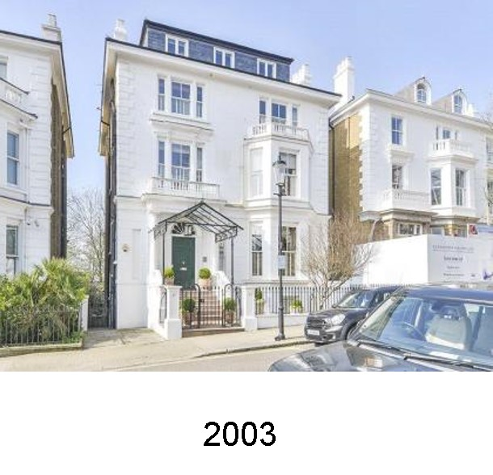
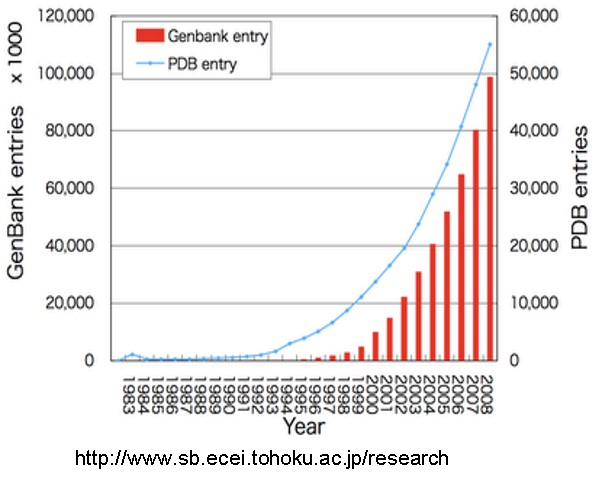
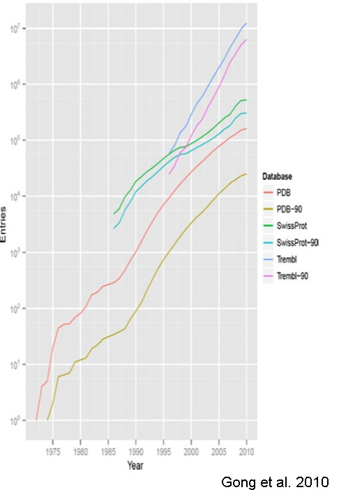
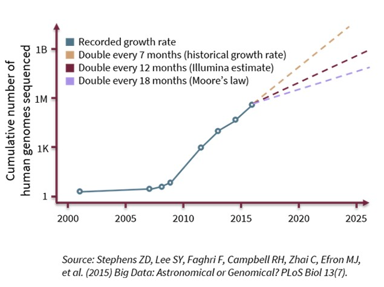
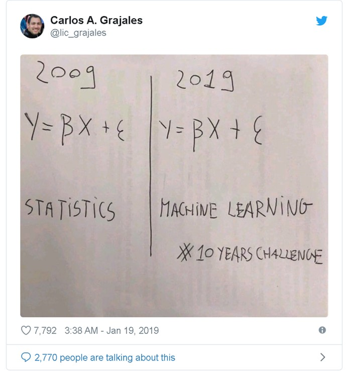

## {data-background=https://www2.mrc-lmb.cam.ac.uk/wordpress/wp-content/uploads/Brenner_00835_9.jpg}
- Sydney Brenner (1927 – 2019) Nobel Prize 2002
- Progress in science depends on new techniques, new discoveries, and new ideas, probably in that order

## {data-background=https://pbs.twimg.com/media/Dbo4wZ5VwAAo6xv.jpg}

- 

- 

- 

## {data-background=Images/sequencing-cost.jpg}

## The growth of genomic data

- 

- 

- 

## Even bigger - multi omics {data-background=http://www.biomech.ulg.ac.be/wp-content/uploads/2019/02/mutli-omics_new.png}

## AI & ML 

- Where there’s data, there’s AI
- But, data quality (QC) over quantity
- Quality adjustment by AI? 

- 

