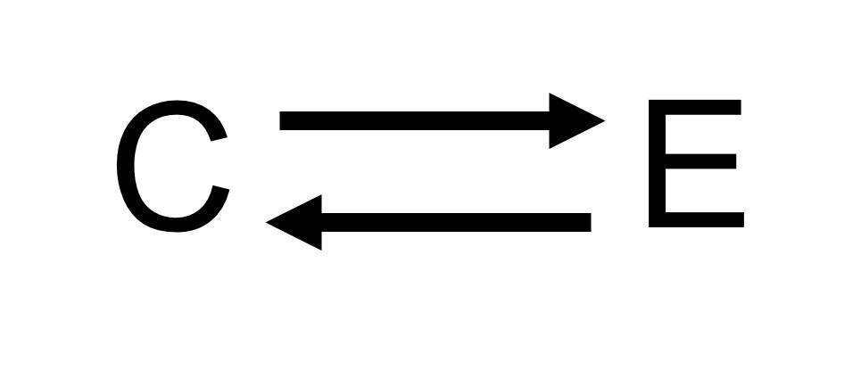
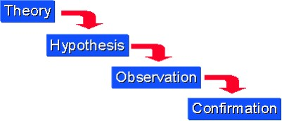
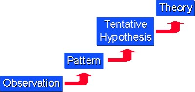

## Science (from the Latin scientia, meaning "knowledge") refers to any systematic knowledge-base or prescriptive practice that is capable of resulting in a prediction or predictable type of outcome
* 
* Reasoning

## Science & Reasoning
- Inductive reasoning
    - Induction (귀납법):reasoning from a specific case or cases and deriving a general rule 
- Pattern recognition (recursive)
    - Fractal
- A process of making general rules behind observations
    - Further to prediction
- 사주, 팔자, 관상

- 

- 

## Repeatability vs. reproducibility

## Repeatability vs. reproducibility

## 

## 

## {data-background=Images/fair.jpg}

## {data-background=https://i.ytimg.com/vi/jFekfemq7qU/maxresdefault.jpg}

## CI/CD in research

## {data-background=Images/recommended_reads.jpg}

## {data-background=https://sung.github.io/images/TRUTH.gif}
- Many thanks
- 
