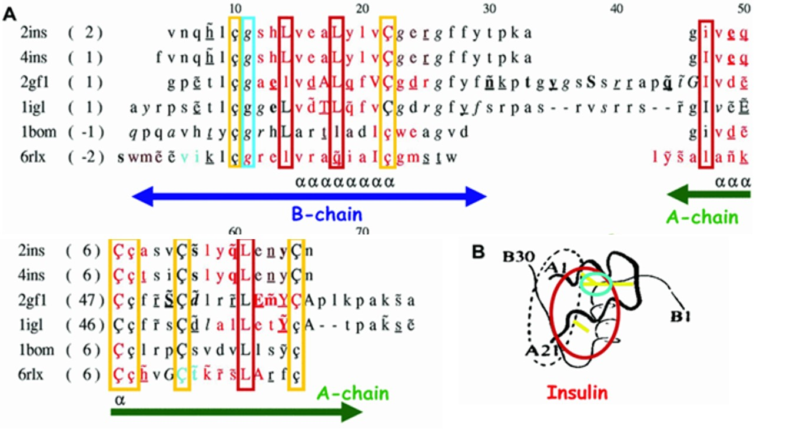
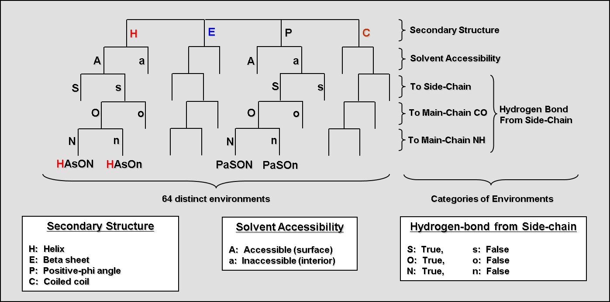
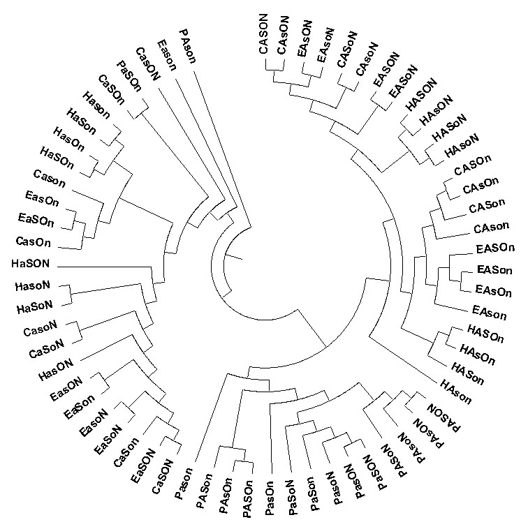
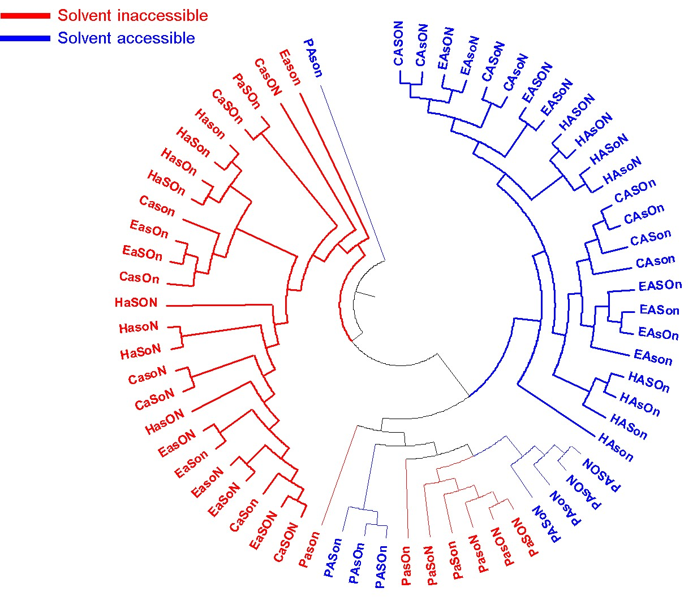
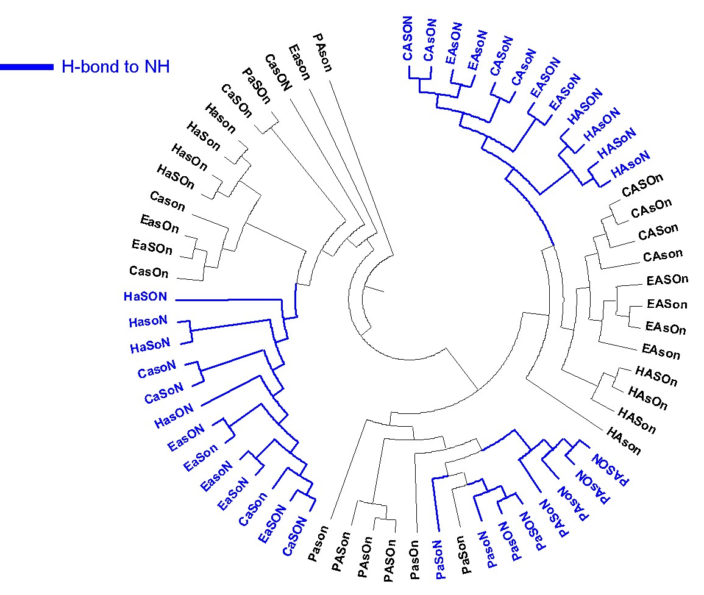
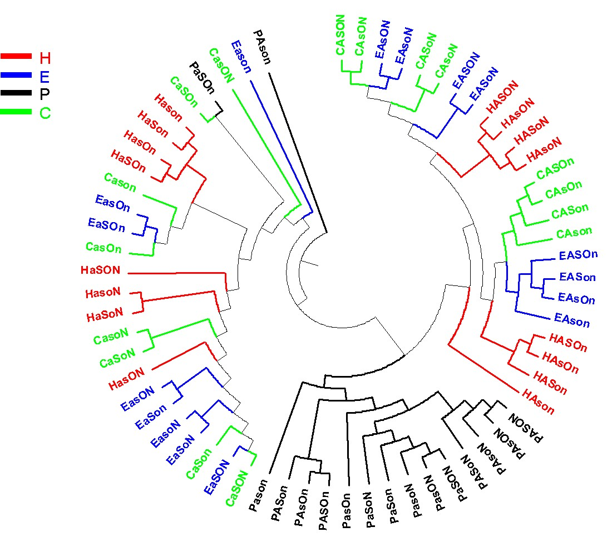
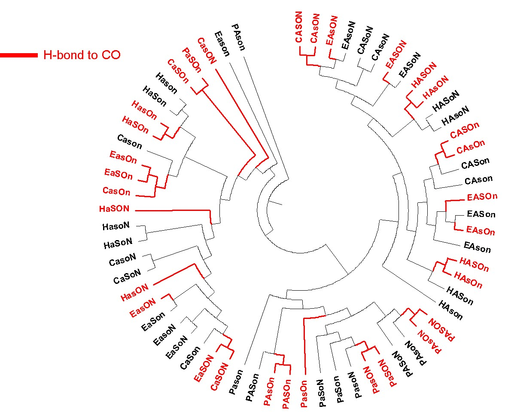
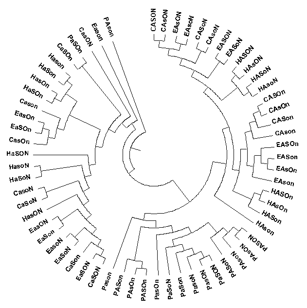

## The 'great' stamp collectors
- Charles Darwin
    - 5 yrs voyage from 1831
- Gregor Mendel
    - 29,000 garden peas between 1856 and 1863 
    - Laws of inheritance
- Fred Sanger
    - Insulin sequence in 1950s
- Max Perutz and John Kendrew
    - 3D structure of hemoglobin in 1959
- Dorothy Hodgkin
    - Penicillin & vitamin B12
    - 3D structure of insulin in 1960s
- Tom Blundell
    - EGFR, HIV protease, crystallins
    - ~200 3D structures of proteins

## Insulin: Structure, Function and Evolution 

- Blundell TL, Cutfield JF, Cutfield SM, 
  Dodson GG, Dodson E, Mercola D, Vijayan M 
  and Hodgkin DC (1971)
  Atomic positions in 2-Zinc insulin crystals  
  Nature 231, 506-511

## Insulin-like Superfamily: Structures & Functions {data-background="Images/insuline-like1.jpg"}

## ESST: Environment Specific Substitution Table {data-background="Images/ESST1.jpg"}

## Local Structural Environments

## 

## 

## 

## 

## 

## 

